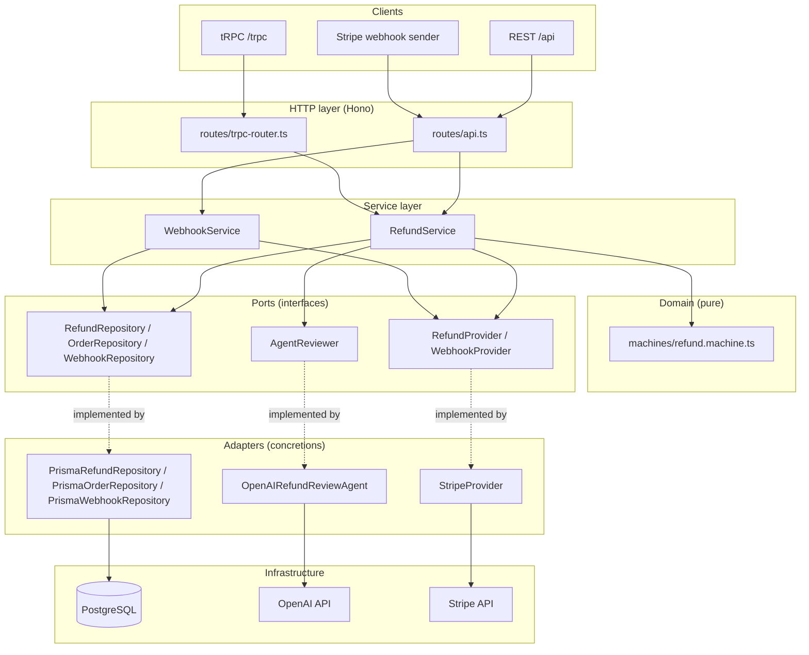
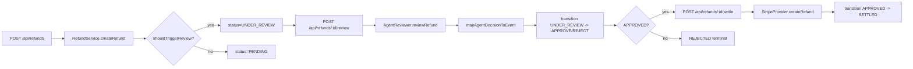
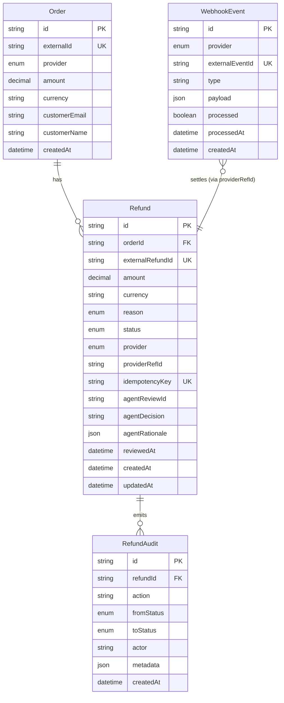
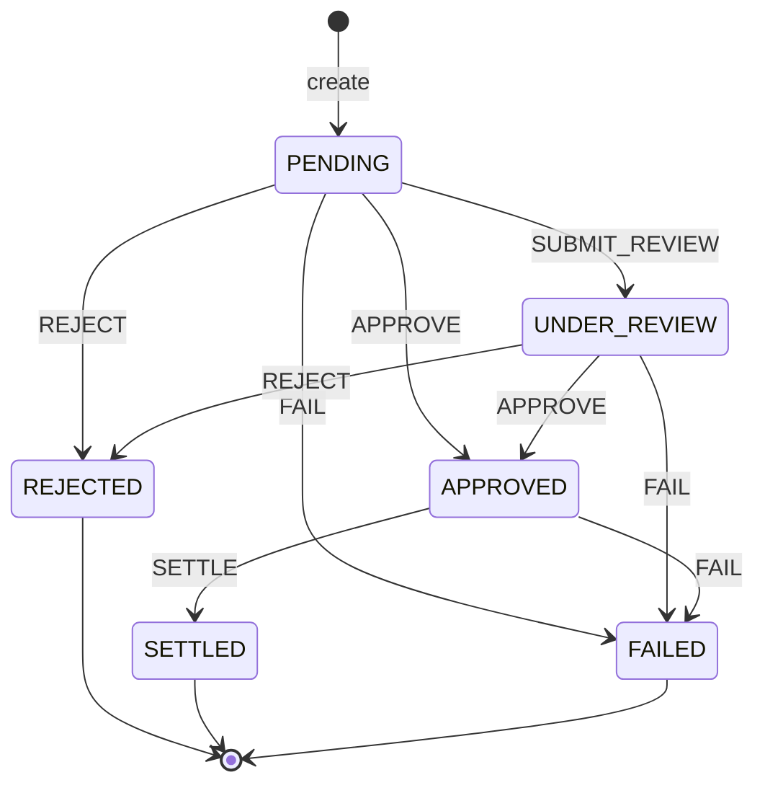
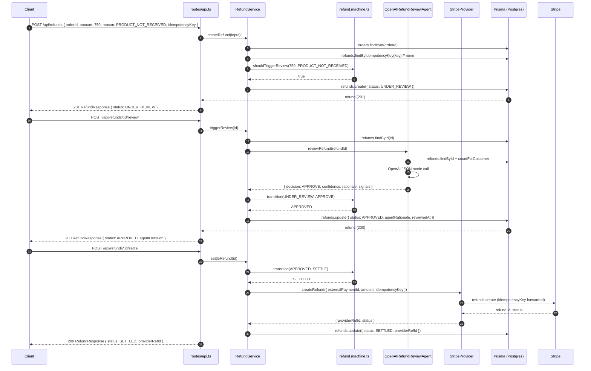
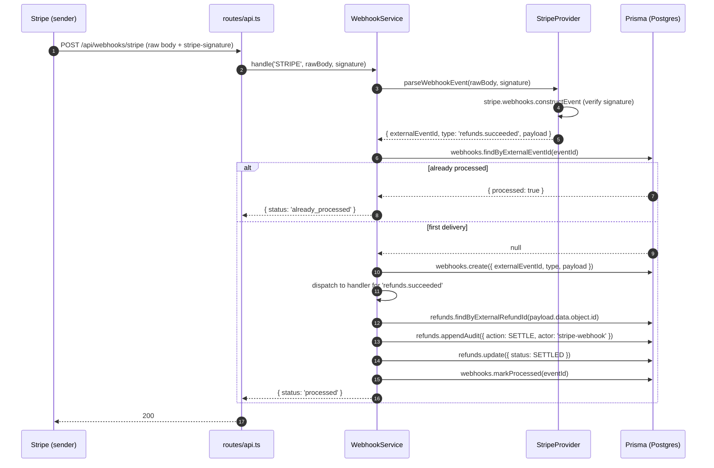
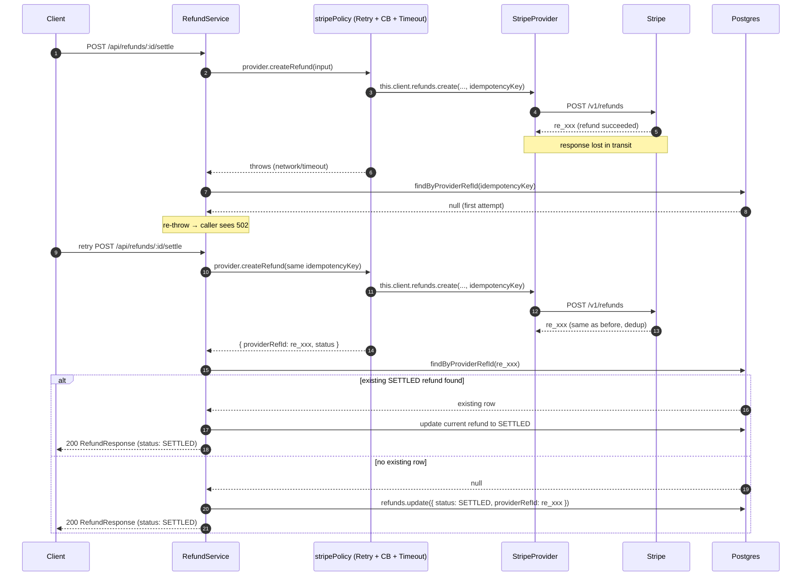

# RefundFlow — Technical Documentation

> Companion document to the README. This file targets engineers maintaining, extending, or reviewing the RefundFlow backend. For usage, quick start, and Postman instructions, see [`README.md`](../README.md).

## Table of contents
1. [System overview](#1-system-overview)
2. [Architecture](#2-architecture)
3. [Module reference](#3-module-reference)
4. [Data model](#4-data-model)
5. [Refund state machine](#5-refund-state-machine)
6. [API contract reference](#6-api-contract-reference)
7. [Error handling](#7-error-handling)
8. [Security model](#8-security-model)
9. [Idempotency & webhooks](#9-idempotency--webhooks)
10. [Observability](#10-observability)
11. [Testing strategy](#11-testing-strategy)
12. [Extension points](#12-extension-points)
13. [Sequence diagrams](#13-sequence-diagrams)
14. [Known limitations & tech debt](#14-known-limitations--tech-debt)
15. [Resilience: retry, circuit breaker, reconcile](#15-resilience-retry-circuit-breaker-reconcile)

---

## 1. System overview

RefundFlow is a backend service that lets e-commerce merchants orchestrate refunds across payment providers (Stripe, PayPal-planned) via REST and tRPC APIs. Its defining feature is an **AI agent** that reviews high-risk refund requests for fraud signals, while a **finite state machine (FSM)** guarantees that no agent decision can violate business invariants.

### Design goals
| Goal | Mechanism |
|------|-----------|
| Type safety end-to-end | Strict TypeScript + Zod schemas |
| Single source of truth for validation + docs | `@hono/zod-openapi` generates OpenAPI from the same Zod schemas used at runtime |
| AI quality owned by the platform | Agent output is JSON-parsed, validated, and funneled through the FSM |
| Extensibility | DI composition root + pluggable providers / handlers |
| Auditability | Append-only `RefundAudit` table + structured JSON logs |
| Idempotency | `idempotencyKey` on refunds, `externalEventId` dedup on webhooks |

### Non-goals (current scope)
- No authentication / authorization (see [§8](#8-security-model)).
- No multi-tenancy; single merchant context.
- No async job queue; refund settlement is synchronous.
- No frontend; API + docs only.

---

## 2. Architecture

### High-level



### Composition root

`src/server/composition.ts:14` is the **only** place that knows about concretions. It wires Prisma repositories, the OpenAI agent, the Stripe provider, and injects them into the services. Services depend on interfaces, never on concretions.

### Request flow (high-risk refund)



---

## 3. Module reference

### `src/server/`
| File | Responsibility |
|------|----------------|
| `index.ts` | Boot: builds Hono app, mounts `/api` (REST + Scalar), mounts `/trpc/*`, enables CORS, starts `@hono/node-server` on `PORT` (default `3527`) |
| `composition.ts` | DI root — instantiates PrismaClient, repos, agent, providers, services |

### `src/routes/`
| File | Responsibility |
|------|----------------|
| `api.ts` | Declares OpenAPI routes via `createRoute(...)`, attaches handlers, mounts Scalar UI at `/docs`, exposes `/openapi.json`, central error handler |
| `trpc-router.ts` | tRPC v11 router factory — 7 procedures mirroring the REST surface, receives injected `RefundService` |

### `src/services/`
| File | Responsibility |
|------|----------------|
| `refund.service.ts` | Refund lifecycle orchestration: create, get, list, triggerReview, settle, approve, reject. Owns the call sequence: validate → transition → persist → audit |
| `webhook.service.ts` | Webhook ingest + dispatch. Deduplicates by `externalEventId`, dispatches to registered `WebhookHandler` per event type |

### `src/machines/`
| File | Responsibility |
|------|----------------|
| `refund.machine.ts` | **Pure** FSM: `transition`, `canTransition`, `nextStatus`, `InvalidTransitionError`, `REFUND_RULES`, `shouldTriggerReview`. No I/O, no persistence — the load-bearing invariant |

### `src/repositories/`
| File | Responsibility |
|------|----------------|
| `interfaces.ts` | Port interfaces: `RefundRepository`, `OrderRepository`, `WebhookRepository`. Uses `Prisma.RefundGetPayload<{ include: { order: true } }>` to type relations |
| `prisma.repositories.ts` | Adapter: Prisma implementations of all three interfaces |

### `src/providers/`
| File | Responsibility |
|------|----------------|
| `types.ts` | Segregated port interfaces: `RefundProvider`, `WebhookProvider`, plus `ProviderRefundInput/Result`, `ParsedWebhook` |
| `stripe.provider.ts` | Stripe adapter implementing **both** interfaces — refunds + webhook signature verification |
| `registry.ts` | In-memory provider registry with `registerRefundProvider`, `registerWebhookProvider`, `getRefundProvider`, `getWebhookProvider`, `initProviders` |

### `src/ai/`
| File | Responsibility |
|------|----------------|
| `types.ts` | `AgentReviewer` interface + `AgentReviewResult` shape |
| `review-agent.ts` | `OpenAIRefundReviewAgent` — gathers context, calls OpenAI JSON mode, parses structured decision |

### `src/schemas/`
| File | Responsibility |
|------|----------------|
| `refund.ts` | All Zod schemas: `CreateRefundSchema`, `RefundResponseSchema`, `RefundListSchema`, `ErrorResponseSchema`, `HealthResponseSchema`, `AgentReviewResultSchema`. Single source of truth for validation + OpenAPI |

### `src/lib/`
| File | Responsibility |
|------|----------------|
| `errors.ts` | `DomainError` hierarchy with `code` + `statusCode`: `NotFoundError` (404), `ConflictError` (409), `ValidationError` (422), `ProviderError` (502), `UnauthorizedError` (401) |

### `src/utils/`
| File | Responsibility |
|------|----------------|
| `logger.ts` | Minimal structured JSON logger writing to stdout: `{ ts, level, msg, meta }` |

---

## 4. Data model

Source of truth: [`prisma/schema.prisma`](../prisma/schema.prisma).

### ERD



### Enums
| Enum | Values |
|------|--------|
| `RefundStatus` | `PENDING`, `UNDER_REVIEW`, `APPROVED`, `REJECTED`, `SETTLED`, `FAILED` |
| `ProviderName` | `STRIPE`, `PAYPAL` (provider enum exists; no PayPal adapter yet) |
| `RefundReason` | `FRAUDULENT`, `DUPLICATE`, `PRODUCT_NOT_RECEIVED`, `PRODUCT_DEFECTIVE`, `CUSTOMER_REQUEST`, `OTHER` |

### Indexes
- `Order`: `@@index([provider, externalId])`, unique `externalId`
- `Refund`: `@@index([status])`, `@@index([orderId])`, unique `idempotencyKey`, unique `externalRefundId`
- `RefundAudit`: `@@index([refundId])`, cascade delete with parent `Refund`
- `WebhookEvent`: `@@index([provider, type])`, unique `externalEventId`

### Money handling
`amount` is `Decimal(12, 2)` in Postgres; the Prisma client surfaces it as `Prisma.Decimal`. The API layer converts via `Number(r.amount)` in `serializeRefund` (`src/routes/api.ts:233`) and Stripe via `Math.round(input.amount * 100)` (`src/providers/stripe.provider.ts:19`) for cents conversion.

---

## 5. Refund state machine

Source of truth: [`src/machines/refund.machine.ts`](../src/machines/refund.machine.ts).

### State diagram



### Transition table
| From | Event | To |
|------|-------|-----|
| `PENDING` | `SUBMIT_REVIEW` | `UNDER_REVIEW` |
| `PENDING` | `APPROVE` | `APPROVED` |
| `PENDING` | `REJECT` | `REJECTED` |
| `PENDING` | `FAIL` | `FAILED` |
| `UNDER_REVIEW` | `APPROVE` | `APPROVED` |
| `UNDER_REVIEW` | `REJECT` | `REJECTED` |
| `UNDER_REVIEW` | `FAIL` | `FAILED` |
| `APPROVED` | `SETTLE` | `SETTLED` |
| `APPROVED` | `FAIL` | `FAILED` |

**Terminal states:** `REJECTED`, `SETTLED`, `FAILED`. Any further event from a terminal state throws `InvalidTransitionError`.

### Review routing rule
```ts
// src/machines/refund.machine.ts:60-67
REFUND_RULES.highValueThreshold = 500
REFUND_RULES.fraudReason       = 'FRAUDULENT'
requiresReview(amount, reason) = amount >= 500 || reason === 'FRAUDULENT'
```
A refund matching this rule is persisted directly as `UNDER_REVIEW` on creation; otherwise `PENDING`.

### FSM API surface
| Function | Behavior |
|----------|----------|
| `nextStatus(current, event)` | Returns next status or `undefined` (no throw) |
| `canTransition(current, event)` | Boolean guard |
| `transition(current, event)` | Returns next status or **throws `InvalidTransitionError`** |
| `shouldTriggerReview(amount, reason)` | Routing predicate (delegates to `REFUND_RULES.requiresReview`) |

### Invariant guarantee
The AI agent returns `decision ∈ { APPROVE, REJECT, NEEDS_HUMAN }`. `RefundService.triggerReview` (`src/services/refund.service.ts:59-77`) maps `NEEDS_HUMAN` → `REJECT` and **always** funnels the resulting event through `transition()`. Even a malformed agent output cannot bypass the FSM — at worst, the transition throws `InvalidTransitionError` and surfaces as a 422.

---

## 6. API contract reference

Base URL: `http://localhost:3527` (overridable via `WEBHOOK_BASE_URL`).
All request/response bodies are `application/json` unless noted. Schemas are generated into OpenAPI 3.0.0 and viewable at `/api/docs` (Scalar).

### 6.1 `GET /api/health`
- **Tag:** System
- **Purpose:** Liveness probe.
- **200** — `HealthResponseSchema`:
  ```json
  { "status": "ok", "ts": "2026-06-29T10:00:00.000Z" }
  ```

### 6.2 `POST /api/refunds`
- **Tag:** Refunds
- **Purpose:** Create a refund. Auto-routes to `UNDER_REVIEW` if `amount >= 500` or `reason = FRAUDULENT`.
- **Request** — `CreateRefundSchema`:
  | Field | Type | Constraints |
  |-------|------|-------------|
  | `orderId` | string | cuid |
  | `amount` | number | positive, ≤ 1,000,000 |
  | `currency` | string | 3 chars, default `USD` |
  | `reason` | enum | one of `RefundReason` |
  | `idempotencyKey` | string | 8–64 chars, unique |
  | `provider` | enum | `STRIPE` \| `PAYPAL` |
- **Responses:**
  - **201** — `RefundResponseSchema` (see §6.7)
  - **409** — `ErrorResponseSchema` (`CONFLICT`, idempotency key reused)
  - **422** — `ErrorResponseSchema` (`VALIDATION_ERROR`, schema or business rule failure)
- **Business rules** (enforced in `RefundService.createRefund`, `src/services/refund.service.ts:21-47`):
  - Order must exist (else `NOT_FOUND` 404)
  - `order.provider === input.provider` (else `VALIDATION_ERROR` 422)
  - `idempotencyKey` must not already exist (else `CONFLICT` 409)
  - `amount ≤ order.amount` (else `VALIDATION_ERROR` 422)

### 6.3 `GET /api/refunds`
- **Tag:** Refunds
- **Query:** `limit` (string, default `20`), `offset` (string, default `0`)
- **200** — `RefundListSchema`:
  ```json
  { "items": [RefundResponse], "total": 0, "limit": 20, "offset": 0 }
  ```
- **Note:** Query params are strings because Hono OpenAPI parses them as such; the handler coerces via `Number()` (`src/routes/api.ts:158-159`).

### 6.4 `GET /api/refunds/{id}`
- **Tag:** Refunds
- **Path:** `id` (string)
- **Responses:**
  - **200** — `RefundResponseSchema`
  - **404** — `ErrorResponseSchema` (`NOT_FOUND`)

### 6.5 `POST /api/refunds/{id}/review`
- **Tag:** AI Review
- **Purpose:** Trigger the OpenAI agent. Refund must be `UNDER_REVIEW`.
- **Responses:**
  - **200** — `RefundResponseSchema` (with `agentDecision`, `agentRationale`, `reviewedAt` populated)
  - **422** — `ErrorResponseSchema` (refund not in `UNDER_REVIEW`)
- **Behavior** (`src/services/refund.service.ts:59-77`):
  1. Load refund + order
  2. Guard `status === 'UNDER_REVIEW'`
  3. Call `agent.reviewRefund(refundId)` — `OpenAIRefundReviewAgent` gathers context (prior refund count via `countForCustomer`, days since order) and calls OpenAI JSON mode
  4. Map `decision` → FSM event (`NEEDS_HUMAN` → `REJECT`)
  5. `transition(current, event)` — throws on illegal move
  6. Persist `status`, `agentDecision`, `agentRationale`, `reviewedAt`

### 6.6 `POST /api/refunds/{id}/settle`
- **Tag:** Refunds
- **Purpose:** Settle an `APPROVED` refund via the payment provider.
- **Responses:**
  - **200** — `RefundResponseSchema` (`providerRefId` populated, status `SETTLED` or `FAILED`)
  - **422** — invalid transition (not `APPROVED`)
  - **502** — `PROVIDER_ERROR` (Stripe call failed → refund transitioned to `FAILED`)
- **Behavior** (`src/services/refund.service.ts:79-100`):
  1. `transition(APPROVED, SETTLE)` → `SETTLED` (throws if not `APPROVED`)
  2. Resolve provider via `resolveProvider(refund.provider)`
  3. Call `provider.createRefund({ externalPaymentId, amount, currency, reason, idempotencyKey })`
  4. If `result.status === 'failed'` → `transition(SETTLED, FAIL)` → `FAILED`
  5. Persist `status`, `providerRefId`, `externalRefundId`

### 6.7 `RefundResponseSchema` (shared)
```json
{
  "id": "ckrefund0001",
  "orderId": "ckabc1234567890xyz",
  "amount": 750,
  "currency": "USD",
  "reason": "PRODUCT_NOT_RECEIVED",
  "status": "UNDER_REVIEW",
  "provider": "STRIPE",
  "providerRefId": null,
  "agentDecision": null,
  "agentRationale": null,
  "reviewedAt": null,
  "createdAt": "2026-06-29T10:00:00.000Z",
  "updatedAt": "2026-06-29T10:00:00.000Z"
}
```

### 6.8 `POST /api/refunds/{id}/approve` and `/reject`
- **Tag:** Refunds
- **Purpose:** Manual transition for admin overrides.
- **Behavior** (`src/services/refund.service.ts:102-126`): applies `APPROVE` or `REJECT` event through `transition()`, persists new status, and appends to `RefundAudit` with `actor = 'admin'`.
- **Responses:** **200** `RefundResponseSchema`. Throws on invalid transition (422).

### 6.9 `POST /api/webhooks/stripe`
- **Tag:** Webhooks
- **Headers:** `stripe-signature` (required, string)
- **Body:** `text/plain` — the raw Stripe event payload (must be raw for signature verification)
- **Responses:**
  - **200** — `{ "status": "processed" }` or `{ "status": "already_processed" }` (idempotent dedup)
  - **502** — `PROVIDER_ERROR` (signature verification failure, see `StripeProvider.parseWebhookEvent`)
- **Behavior** (`src/services/webhook.service.ts:33-62`):
  1. `provider.parseWebhookEvent(rawBody, signature)` — Stripe SDK verifies the signature
  2. Lookup `webhookEvent` by `externalEventId`; if `processed`, short-circuit with `already_processed`
  3. Persist the `WebhookEvent` row
  4. Dispatch to the registered handler for `parsed.type` (default handler for `refunds.succeeded` settles the matching refund)
  5. Mark `processed = true`

### 6.10 tRPC gateway (`/trpc/*`)
The tRPC v11 router mirrors the REST surface for typed dashboard clients. Procedures use the same `RefundService` instance, so behavior is identical.

| Procedure | Type | Input |
|-----------|------|-------|
| `refunds.createRefund` | mutation | `CreateRefundSchema` |
| `refunds.getRefund` | query | `{ id: cuid }` |
| `refunds.listRefunds` | query | `{ limit?, offset? }` |
| `refunds.triggerReview` | mutation | `{ refundId: cuid }` |
| `refunds.settleRefund` | mutation | `{ refundId: cuid }` |
| `refunds.approveRefund` | mutation | `{ refundId: cuid, actor? }` |
| `refunds.rejectRefund` | mutation | `{ refundId: cuid, actor? }` |

Call convention: `POST /trpc/<router>.<procedure>` with `Content-Type: application/json` and body `{ "json": <input> }` (tRPC v11 link transport).

---

## 7. Error handling

### Error hierarchy
`DomainError` (`src/lib/errors.ts:1-10`) is the base class with `code` + `statusCode`. Subclasses:

| Class | `code` | Status | Thrown when |
|-------|--------|--------|-------------|
| `NotFoundError` | `NOT_FOUND` | 404 | Order/refund not found |
| `ConflictError` | `CONFLICT` | 409 | Idempotency key reused |
| `ValidationError` | `VALIDATION_ERROR` | 422 | Business rule violation, illegal FSM transition guard, Zod parse failure of agent output |
| `ProviderError` | `PROVIDER_ERROR` | 502 | Stripe refund create or webhook signature failure |
| `UnauthorizedError` | `UNAUTHORIZED` | 401 | *(Defined but not currently used — see §8)* |
| `DomainError` (direct) | varies | varies | `NO_PROVIDER` (500) when no provider registered for a name |
| — | `INTERNAL` | 500 | Unhandled error (logged via `console.error`) |

### Central handler
`src/routes/api.ts:215-224` installs a single `app.onError` that:
1. Maps `DomainError` → its `statusCode` + `{ error: { code, message } }`
2. Maps `ZodError` → 422 + `issues`
3. Logs and returns 500 for anything else

### Error response shape
```json
{
  "error": {
    "code": "VALIDATION_ERROR",
    "message": "Refund amount exceeds order amount",
    "issues": [ /* optional, present on Zod failures */ ]
  }
}
```

---

## 8. Security model

> ⚠️ **Limitation:** RefundFlow currently has **no authentication or authorization**. Every endpoint (including admin-only ones like `/approve` and `/reject`) is publicly callable. This is intentional for the demo/learning scope but **must not ship to production as-is**.

### What is secured today
- **Stripe webhooks** — verified via `stripe.webhooks.constructEvent(rawBody, signature, webhookSecret)` inside `StripeProvider.parseWebhookEvent` (`src/providers/stripe.provider.ts:47-54`). Invalid signatures throw `ProviderError` (502).
- **Idempotency** — refunds require a unique `idempotencyKey` (8–64 chars, DB-enforced), so a replayed create returns 409 instead of a duplicate.
- **CORS** — wide-open (`cors()`) in `src/server/index.ts:11`. Tighten before production.

### What is NOT secured
- REST endpoints — no API key, no JWT, no session.
- tRPC gateway — no context-bound auth.
- Admin transitions (`/approve`, `/reject`) — any caller can move a refund to `APPROVED`.
- Provider keys — read from env vars at boot; the `StripeProvider` constructor stores the secret key in memory.

### Recommended production hardening
1. **Add an auth middleware** before the `/api/refunds/*` routes — Hono supports `app.use('/api/*', bearerAuth({ token }))` or a JWT verifier (`hono/jwt`). The existing `UnauthorizedError` (`src/lib/errors.ts:40-45`) is already plumbed for this.
2. **Separate admin scopes** — `/approve` and `/reject` should require an `admin` role; the actor is already a parameter (`src/services/refund.service.ts:102, 106`) but isn't read from the request.
3. **Restrict CORS** to known dashboard origins.
4. **Secrets management** — load `STRIPE_SECRET_KEY`, `STRIPE_WEBHOOK_SECRET`, `OPENAI_API_KEY` from a secrets manager (AWS Secrets Manager, Doppler, Vault) rather than `.env`.
5. **Rate limiting** — add `hono/rate-limiter` on `/api/refunds` and `/api/refunds/:id/review` (LLM calls are costly).
6. **Audit actor on every mutation** — currently only `approve`/`reject` write to `RefundAudit`; `createRefund`, `triggerReview`, `settleRefund` should also emit audit events with the authenticated caller.

---

## 9. Idempotency & webhooks

### Refund creation idempotency
- The client supplies `idempotencyKey` (8–64 chars, unique in `Refund.idempotencyKey`).
- `RefundService.createRefund` checks `refunds.findByIdempotencyKey` first (`src/services/refund.service.ts:29`); a hit returns `ConflictError` (409).
- The same key is forwarded to Stripe as the SDK idempotency key on settlement (`src/providers/stripe.provider.ts:23`), so a retried settle won't double-refund.

### Webhook idempotency
- `WebhookEvent.externalEventId` is unique (the Stripe event `id`).
- `WebhookService.handle` queries `findByExternalEventId` before persisting (`src/services/webhook.service.ts:37-41`); a `processed` row short-circuits with `{ status: 'already_processed' }`.
- The `processed` flag + `processedAt` are set only after the handler completes (`src/services/webhook.service.ts:56`), so a crash mid-handling leaves the event re-processable.

### Webhook signature verification
- Stripe signs the **raw** request body. The route reads `await c.req.text()` (`src/routes/api.ts:189`) and passes it to `StripeProvider.parseWebhookEvent`.
- `stripe.webhooks.constructEvent(rawBody, signature, webhookSecret)` throws on tampering; the catch wraps it as `ProviderError` (502).

### Default webhook handlers
Registered in `defaultHandlers()` (`src/services/webhook.service.ts:65-87`):
| Event type | Action |
|------------|--------|
| `refunds.succeeded` | Look up refund by `externalRefundId` (the Stripe refund id from the payload), transition to `SETTLED`, append audit with `actor = 'stripe-webhook'` |

Unrecognized event types are logged (`webhook.unhandled`) and marked processed without side effects.

---

## 10. Observability

### Logging
`src/utils/logger.ts` emits one JSON line per event to stdout:
```json
{ "ts": "2026-06-29T10:00:00.000Z", "level": "info", "msg": "refund.review.completed", "meta": { "refundId": "ck...", "decision": "APPROVE" } }
```

### Notable log events
| Event | Level | Where |
|-------|-------|-------|
| `server.started` | info | `src/server/index.ts:32` |
| `composition.root.built` | info | `src/server/composition.ts:40` |
| `refund.review.completed` | info | `src/services/refund.service.ts:66` |
| `agent.review.start` / `agent.review.done` | info | `src/ai/review-agent.ts:35, 51` |
| `stripe.refund.failed` | error | `src/providers/stripe.provider.ts:31` |
| `webhook.duplicate` | info | `src/services/webhook.service.ts:39` |
| `webhook.unhandled` | info | `src/services/webhook.service.ts:55` |
| `webhook.refund.settled` | info | `src/services/webhook.service.ts:83` |
| `webhook.process.failed` | error | `src/services/webhook.service.ts:59` |

### Gaps
- No request ID / correlation id propagated.
- No metrics (Prometheus, OpenTelemetry) — recommended before production.
- Prisma query logging only in `NODE_ENV=development`.

---

## 11. Testing strategy

### Tooling
- **Vitest** (`vitest.config.ts`) — `environment: 'node'`, includes `tests/**/*.test.ts`.
- Run via `npm run test` (one-shot) or `npm run test:watch`.

### Coverage
| Test file | What it covers |
|-----------|-----------------|
| `tests/refund.machine.test.ts` | All FSM transitions, terminal-state guards, `InvalidTransitionError`, `shouldTriggerReview` rule (threshold, fraud, low-value non-fraud) |
| `tests/refund.schema.test.ts` | Zod schema validation (see file) |
| `tests/resilience.test.ts` | `isRetryableStripeError` predicate (status codes, `StripeConnectionError`, transient node errors); Stripe retry policy (succeeds first try, succeeds after N retries, gives up after maxAttempts, no retry on non-retryable); OpenAI policy + fallback (`NEEDS_HUMAN` after exhausted retries, immediate fallback on non-retryable); circuit breaker state inspection. Uses `vi.useFakeTimers()` to avoid real clock. |

### Gaps
- No service-layer tests (`RefundService` with in-memory repos).
- No webhook handler tests (dedup, `refunds.succeeded` settle path).
- No route/integration tests against the Hono app.
- The agent is now constructor-injectable (`OpenAIRefundReviewAgent(refunds, client?, model?)`), but a vitest for the agent itself (mocked `OpenAI` + fake timers) is still on the wishlist.

### Static checks
| Command | Purpose |
|---------|---------|
| `npm run typecheck` | `tsc --noEmit` in strict mode |
| `npm run lint` | ESLint over `src/**/*.ts` |
| `npm run build` | `tsc` emits to `dist/` with declarations + source maps |

---

## 12. Extension points

The codebase was deliberately structured for extension without modification (Open/Closed).

### Add a new payment provider (e.g. PayPal)
1. Implement `RefundProvider` (and optionally `WebhookProvider`) in `src/providers/paypal.provider.ts`.
2. Register it in `initProviders()` (`src/providers/registry.ts:29`):
   ```ts
   if (paypalKey) {
     const paypal = new PayPalProvider(paypalKey, paypalWebhookSecret)
     registerRefundProvider(paypal)
     registerWebhookProvider(paypal)
   }
   ```
3. No changes to `RefundService`, `WebhookService`, or routes.

### Add a new webhook event type
1. Implement a `WebhookHandler`:
   ```ts
   const handler: WebhookHandler = {
     type: 'refunds.failed',
     async handle(parsed, ctx) { /* ... */ },
   }
   ```
2. Register it on the `WebhookService` instance (e.g. in `composition.ts` after building the service). No edits to `WebhookService` internals.

### Swap the AI agent
1. Implement `AgentReviewer` (`src/ai/types.ts:8`).
2. In `src/server/composition.ts:25`, replace `new OpenAIRefundReviewAgent(...)` with the new implementation. `RefundService` is unchanged because it depends on the interface.

### Swap the database
1. Implement `RefundRepository`, `OrderRepository`, `WebhookRepository` against a different driver (e.g. in-memory for tests, or DynamoDB).
2. Inject in `buildCompositionRoot()`. Services are unchanged.

### Add a new REST endpoint
1. Add a Zod schema in `src/schemas/refund.ts`.
2. `createRoute({ method, path, request, responses })` in `src/routes/api.ts`.
3. `app.openapi(route, handler)` — additive, no edits to existing routes.
4. The endpoint auto-appears in Scalar and `/api/openapi.json`.

---

## 13. Sequence diagrams

### High-risk refund lifecycle (happy path)



### Stripe webhook settlement (idempotent)



---

## 14. Known limitations & tech debt

| Area | Limitation | Recommended fix |
|------|-----------|------------------|
| Auth | No authentication on any endpoint | Add Hono `bearerAuth` or JWT middleware; use the existing `UnauthorizedError` |
| Audit | Only `approve`/`reject` write to `RefundAudit`; `create`, `triggerReview`, `settle` do not | Emit audit events from every mutating method |
| Settlement | `settleRefund` is synchronous; a slow Stripe call blocks the request | Move to a background queue with retry + DLQ (resilience is in place; an outbox is the next step) |
| Webhook handlers | Only `refunds.succeeded` is handled | Add `refunds.failed` → `transition(*, FAIL)` |
| PayPal | Enum value exists but no adapter | Implement `PayPalProvider` (see §12) |
| CORS | Wide-open | Restrict to dashboard origin |
| Rate limiting | None | Add `hono/rate-limiter` on create + review |
| Tests | No service/route/agent tests | See §11 gaps |
| Money | `Number(r.amount)` loses precision past 15 significant digits | Acceptable for `Decimal(12,2)` but worth noting |
| `src/db/` | Empty directory leftover from a deleted `client.ts` | Remove or repurpose |

---

## 15. Resilience: retry, circuit breaker, reconcile

Downstream calls (Stripe, OpenAI) fail in three ways: transient (network blip, 429, 5xx), terminal (400, 401, 404), and outage (provider down for minutes). The resilience layer in `src/lib/resilience.ts` uses [**`cockatiel`**](https://github.com/connor4312/cockatiel) — the Node-TS port of Resilience4j concepts (Retry, CircuitBreaker, Timeout, Fallback as composable policies).

### Policy table

| Downstream | Site | Retry | Timeout | Circuit breaker | Fallback | Final error |
|------------|------|-------|---------|-----------------|----------|-------------|
| Stripe refunds | `StripeProvider.createRefund` | 3 attempts, exp + jitter, 200 ms → 2 s | 8 s aggressive | `ConsecutiveBreaker(5)`, 30 s open | none | `ProviderError` 502 after exhausted retries or open circuit |
| Stripe webhooks | `StripeProvider.parseWebhookEvent` | none | 5 s aggressive | none | none | `ProviderError` 502 |
| OpenAI agent | `OpenAIRefundReviewAgent.reviewRefund` | 2 attempts, exp + jitter, 500 ms → 1.5 s | 15 s aggressive | `ConsecutiveBreaker(10)`, 60 s open | `{ decision: 'NEEDS_HUMAN', confidence: 0, rationale: 'agent_unavailable', signals: [] }` | mapped by `mapAgentDecisionToEvent` → `REJECTED` terminal |

Both **Stripe SDK** and **OpenAI SDK** clients are constructed with `maxRetries: 0` so retry behavior has a **single source of truth** in our policy — otherwise the SDK would also retry internally and our circuit breaker would never open.

### What is retried (and what isn't)

`isRetryableStripeError` (`src/lib/resilience.ts:13`) returns `true` for:

- HTTP status codes in `RETRYABLE_HTTP_STATUS = { 408, 429, 500, 502, 503, 504 }`
- `StripeConnectionError` (any statusCode)
- `StripeAPIError` with `statusCode` in the retryable set
- Node `ECONNRESET`, `ETIMEDOUT`, `ENETUNREACH`, `EAI_AGAIN`, `ECONNREFUSED`, `EPIPE`
- `BrokenCircuitError` and `TaskCancelledError` (cockatiel types — re-attempting after the circuit closes or the deadline is meaningful)

…and **false** for everything else (`StripeInvalidRequestError`, `StripeAuthenticationError`, 4xx other than 408/429, plain `Error`).

### Safety property: agent failure degrades safely

If the OpenAI call fails twice, the timeout fires, or the circuit is open, `withOpenAIPolicy` returns `AGENT_UNAVAILABLE` (`{ decision: 'NEEDS_HUMAN', ... }`). The `mapAgentDecisionToEvent` function in `src/services/refund.service.ts:129-132` already maps `NEEDS_HUMAN → REJECT`, so a refund lands in `REJECTED` (terminal but human-reviewable) instead of hanging. A human can still manually `POST /api/refunds/:id/approve` to move it forward.

### Reconcile-on-retry for settlement

Naive retry of `settleRefund` has a subtle bug: if the Stripe request **succeeds** but the response is lost in transit, our code throws and the next retry sees a brand-new request. Stripe dedupes by `idempotencyKey` and returns the same `re_xxx` — but our DB then transitions `SETTLED → FAILED` (illegal but currently `transition(SETTLED, FAIL)` is allowed; see [§5](#5-refund-state-machine)), losing the actual settlement.

The reconcile branch in `RefundService.settleRefund` (`src/services/refund.service.ts:79-119`) handles two reconcile cases:

1. **Provider call threw but the refund is actually settled** — if `findByProviderRefId(idempotencyKey)` returns a `SETTLED` row, we return that row and log `refund.settle.reconciled`.
2. **Provider call succeeded with a `providerRefId` that already exists in our DB** — common when a concurrent retry wins the race; we propagate the `SETTLED` state to the current refund rather than double-settling.

The standard 1 + 2 catch ensures no double-refund even under concurrent retries.



### Log events (resilience layer)

| Event | Level | When |
|-------|-------|------|
| `resilience.retry` | warn | cockatiel retry policy is about to retry (emits `attempt`, `delay`, `policy`) |
| `resilience.retry.exhausted` | error | retry policy gave up after `maxAttempts` (emits `policy`, `reason`) |
| `resilience.circuit.open` | error | circuit breaker tripped (emits `policy`, `reason`) |
| `resilience.circuit.halfopen` | warn | breaker entered `HalfOpen`, probing |
| `resilience.circuit.close` | info | breaker recovered, back to `Closed` |
| `resilience.timeout` | error | aggressive timeout fired (emits `policy`, `durationMs`) |
| `refund.settle.reconciled` | warn | settle retry path, recovered a `SETTLED` row |
| `refund.settle.reconciled.existing` | warn | settle saw a duplicate `providerRefId` from a concurrent retry |

### Tuning the policies

All constants live at the top of `src/lib/resilience.ts`:
- `RETRYABLE_HTTP_STATUS` (status code set)
- `TRANSIENT_NODE_ERROR_CODES` (Node error codes)
- `stripeRetryPolicy` — `maxAttempts`, `ExponentialBackoff({ initialDelay, maxDelay, exponent })`
- `stripeBreaker` — `halfOpenAfter`, `ConsecutiveBreaker(threshold)`
- `stripeTimeout` — duration + `TimeoutStrategy`
- `openaiRetryPolicy` / `openaiBreaker` / `openaiTimeout` — same shape

For higher-volume deployments, consider replacing `ConsecutiveBreaker` with cockatiel's `SamplingBreaker` (e.g. 50% failure over a 30s window) or `CountBreaker` (sliding window of N calls) — both available in the package.

### Webhooks are intentionally NOT retried in-process

Stripe's webhook delivery model is the safety net: failed webhooks are re-delivered with exponential backoff for up to 3 days. Adding an in-process retry on top would be redundant and risk double-processing if a retry raced a Stripe re-delivery. Webhook idempotency is enforced via the `WebhookEvent.externalEventId` unique constraint and the `processed` flag in `src/services/webhook.service.ts:33-62`. The only resilience applied is a 5 s aggressive timeout on signature verification.
